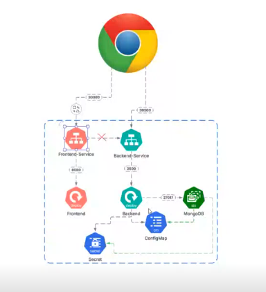

# Harden-Kubernetes-security



## Deploy MongoDB Database

``` bash
kubectl apply -f mongo/manifests/pvc.yaml -n ingress-basic

kubectl apply -f mongo/manifests/secret.yaml -n ingress-basic

kubectl apply -f mongo/manifests/configmap.yaml -n ingress-basic

kubectl apply -f mongo/manifests/statefulset.yaml -n ingress-basic

kubectl apply -f mongo/manifests/service.yaml -n ingress-basic

```

## Deploy Backend
``` bash
kubectl apply -f backend/manifests/deployment.yaml -n ingress-basic

kubectl apply -f backend/manifests/service.yaml -n ingress-basic
```

## Deploy frontend
``` bash
kubectl apply -f frontend/manifests/deployment.yaml -n ingress-basic

kubectl apply -f frontend/manifests/service.yaml -n ingress-basic
```

#### Notes:
.env vars for frontend are injected in the build time :
 -> npm start is a bad practice in dockerfile and means we can inject env vars in runtime which is baad!  

.env vars for backend are injected in runtime

browser communicates with both backend and frontend, it's not frontend that communicates with backend
